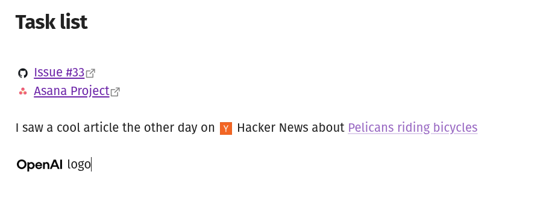

# Brand Icons

Display brand logos and icons inline in your Obsidian notes.

Write `:brand:github.com:` in your note and it renders as an inline icon right next to your text.



## Syntax

```
:brand:github.com:
:brand:spotify.com|logo:
:brand:stripe.com|icon|32:
```

The format is `:brand:domain:` with optional variant and size overrides separated by `|`.

| Part | Required | Description |
|------|----------|-------------|
| domain | Yes | The company's domain, e.g. `github.com` |
| variant | No | `icon`, `logo`, or `symbol` (depends on provider) |
| size | No | Height in pixels, overrides the default |

## Settings

- **Provider** -- which brand icon service to fetch from (default: Brandfetch)
- **Default size** -- icon height in pixels (default: 20)
- **Default variant** -- which logo variant to use when not specified

Each provider may have its own settings. For example, Brandfetch requires a client ID from their [developer portal](https://developers.brandfetch.com/).

## Installation

Copy `main.js`, `manifest.json`, and `styles.css` into your vault at `.obsidian/plugins/brand-icons/`, then enable the plugin in settings.

## Architecture

```
src/
  main.ts             Plugin lifecycle, registers renderers and settings
  parse.ts            Regex tokenizer -> BrandToken {domain, variant?, size?}
  brand-element.ts    BrandToken ->  via provider.buildUrl()
  post-processor.ts   Reading mode: DOM TreeWalker replaces text nodes
  editor-extension.ts Live preview: CodeMirror 6 decorations, reveals syntax at cursor
  settings.ts         Settings interface + dynamic provider-driven UI
  providers/
    provider.ts       BrandProvider interface + registry
    brandfetch.ts     Brandfetch CDN implementation
styles.css            Single rule using Obsidian CSS variables
```

**Data flow:** text node -> `findBrandSpans()` -> `BrandToken` -> `createBrandImg()` -> `provider.buildUrl()` -> ``

## Adding a provider

Create a new file in `src/providers/`, implement the `BrandProvider` interface, and push it to the `providers` array. No other files need changes. The settings UI and URL building are driven entirely by the interface.

## Development

```sh
npm install
npm run dev    # watch mode
npm run build  # production build
```
